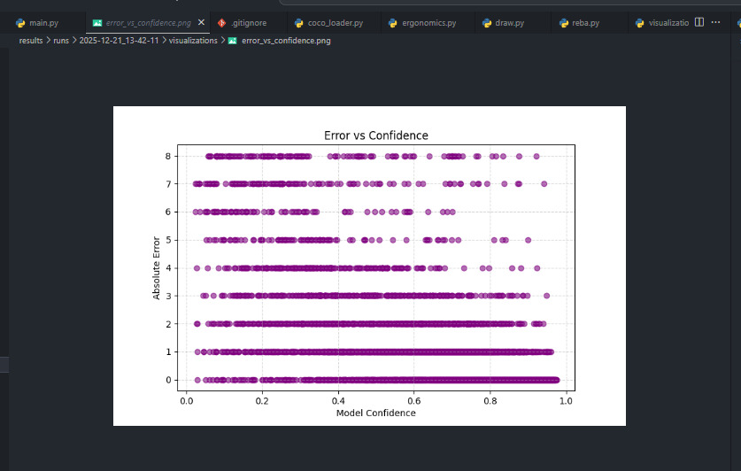
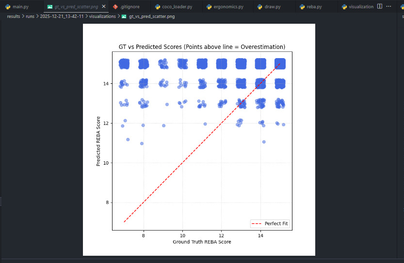
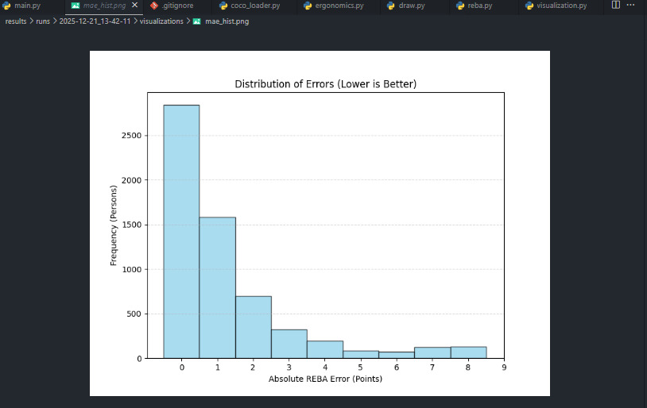
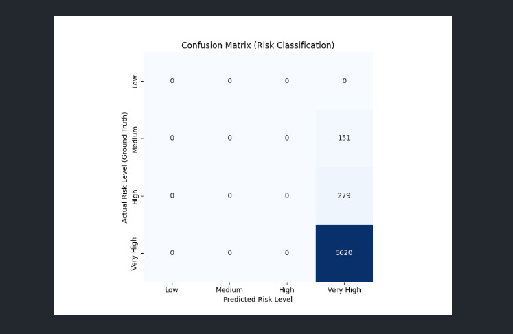
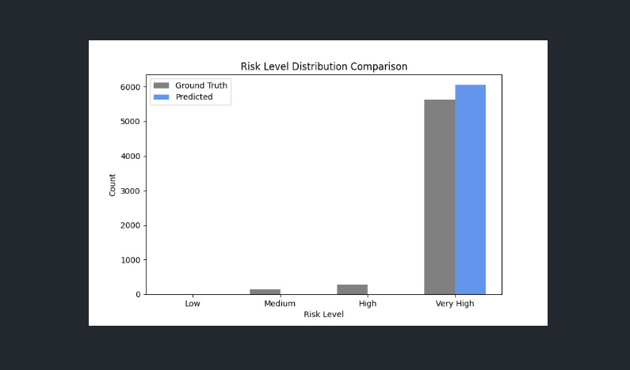

# Deep Learning Pose Ergonomics Analysis

This project implements a **human pose ergonomics analysis system** using a **pretrained YOLOv8 Pose Estimation model**.  
The application detects human body keypoints from video input and evaluates ergonomic risk levels using a **rule-based REBA-lite approach**.

---

## Project Overview

- **Input**
  - Video file (`.mp4`), e.g. office CCTV footage

- **Output**
  - Human bounding boxes
  - Body keypoints (COCO format)
  - Ergonomic risk classification:
    - Low Risk
    - Medium Risk
    - High Risk

- **Model**
  - YOLOv8 Pose (pretrained on COCO dataset)

- **Approach**
  - Pretrained pose estimation
  - Rule-based angle analysis
  - Simplified REBA (upper body focused)

---

## Team Members
| No | Name |
|----|------|
| 1 | Jason Surya Wijaya |
| 2 | Vito Randy Gunawan |
| 3 | Trivina Angellia Chandra |

---

## Visualization Results

The system produces visual outputs to support ergonomic posture analysis:

- **Human Bounding Boxes**  
  Detected individuals are highlighted with bounding boxes.

- **Pose Keypoints Visualization**  
  Human body keypoints (COCO format) such as shoulders, elbows, hips, and knees are displayed.

- **Skeleton Overlay**  
  Keypoints are connected to form a skeleton structure for clearer posture interpretation.

- **Ergonomic Risk Labels**
  - Low Risk  
  - Medium Risk  
  - High Risk  

- **Annotated Video Output**  
  Final output videos display pose estimation results together with ergonomic risk classification.







---

## Dataset

This project utilizes the **COCO 2017 Keypoints dataset** as a reference dataset for human pose estimation.

### Dataset Sources
- **COCO 2017 Validation Images**  
  Link: http://images.cocodataset.org/zips/val2017.zip

- **COCO 2017 Annotations (Train & Validation)**  
  Link: http://images.cocodataset.org/annotations/annotations_trainval2017.zip

### Dataset Usage
- The dataset is **not used for model training** in this project.
- The YOLOv8 Pose model used is **pretrained on the COCO dataset**.
- COCO dataset is referenced for:
  - Keypoint format compatibility (COCO format)
  - Visualization structure
  - Pose estimation benchmarking

- Input data for this system primarily consists of **custom video files (`.mp4`)**.

---

## Project Structure

```text
deep-learning-pose-estimation/
├── assets/
│   ├── pose_visualization_1.jpg
│   ├── pose_visualization_2.jpg
│   ├── pose_visualization_3.jpg
│   ├── pose_visualization_4.jpg
│   └── pose_visualization_5.jpg
│
├── src/
│   ├── main.py
│   ├── pose/
│   │   └── ergonomics.py
│   ├── ergonomics/
│   │   ├── angles.py
│   │   └── reba.py
│   └── utils/
│       ├── draw.py
│       └── visualization.py
│
├── models/
│   └── yolov8s-pose.pt
│
├── datasets/
│   └── coco/
│       └── README.md
│
├── data/
│   └── videos/
│       ├── test.mp4
│       ├── test2.mp4
│       └── test3.mp4
│
├── requirements.txt
├── README.md
└── .gitignore
```

---

## Requirements

- **Python 3.13.x (MANDATORY)**
- pip
- Windows or Linux OS
- Video input (`.mp4`)

---

## Setup Instructions

### 1. Clone Repository

```bash
git clone https://github.com/JasonnSW/deep-learning-pose-estimation.git
cd deep-learning-pose-estimation
```
### 2. Check Python Version
```bash
python --version
```

### 3. Install Dependencies
```bash
pip install -r requirements.txt
```

### 4. Running the Application
```bash
py src/main.py
```
